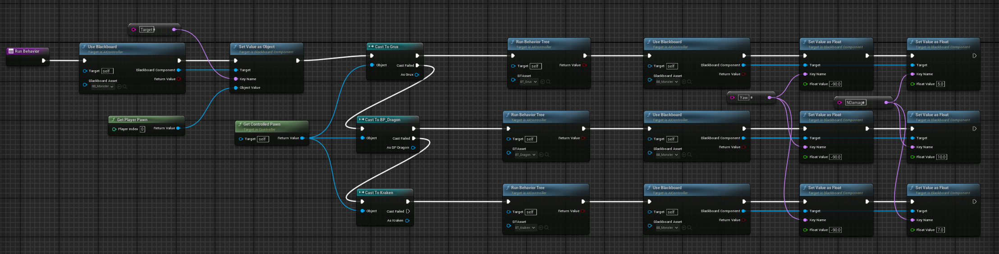
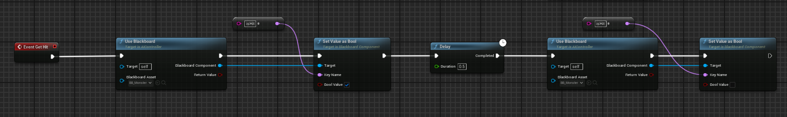
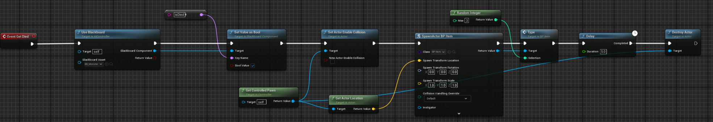
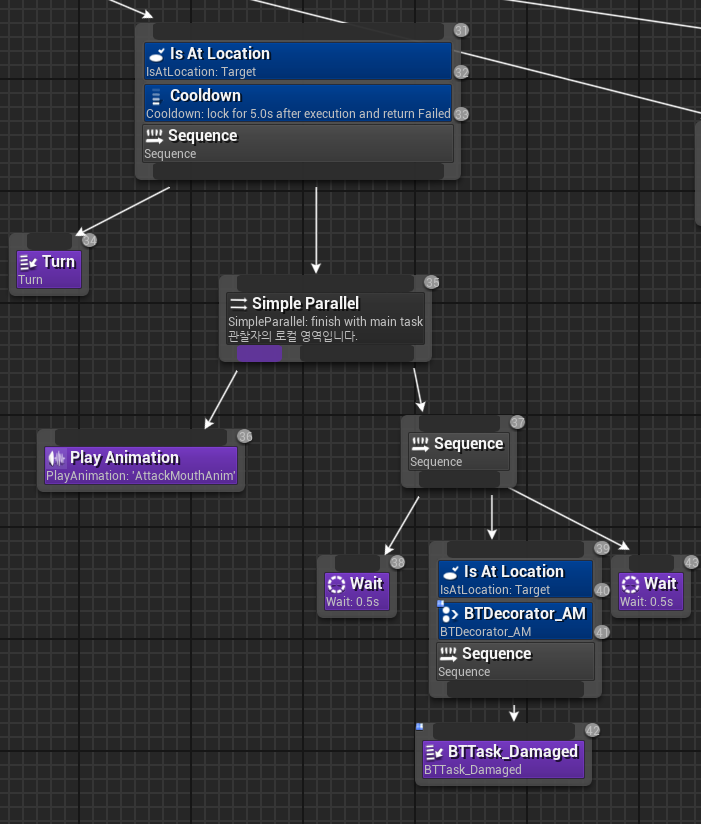
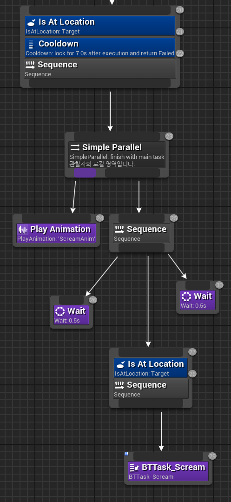
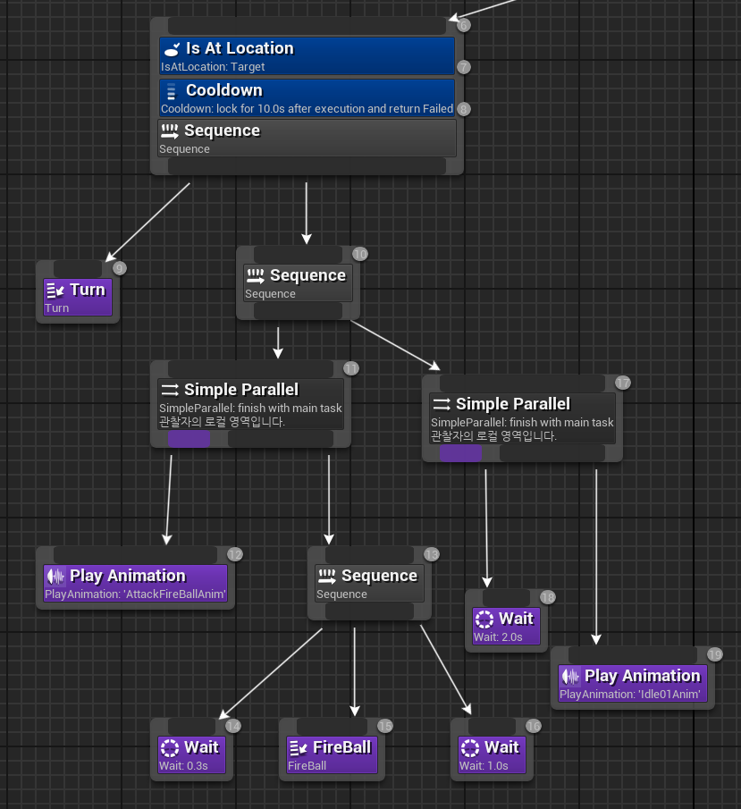
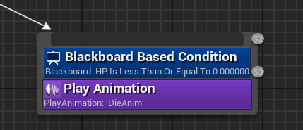
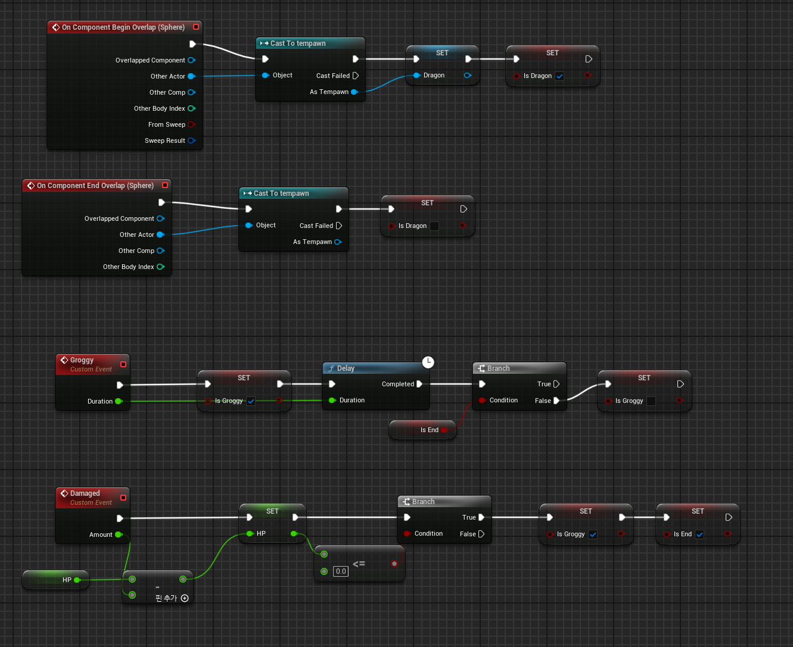

# Project RPG
### 액션 RPG 장르의 보스전을 언리얼 엔진을 통해 만든 포트폴리오용 게임
    보스의 패턴에 따라 적절히 공격과 회피를 하여 보스를 물리치자!
- 개발 규모 : 1인
- 사용 엔진 : Unreal Engine 5.3.2
- 개발 도구 : C++(Visual Studio), BluePrint
- 사용 어셋 : EasyComboBuffering, FantasyBundleEnviroment, FXVarietyPack, Realistic_Starter_VFX_Pack_Vol2

## 개발 범위
### AI 

#### IDLE

    
보스랑 플레이어가 너무 멀거나 너무 가까우면 실행하는 것으로 IDLE01 애니메이션을 재생한다.
#### WALK

WalkAnim을 실행하는 도중에 Player를 Target으로 잡아 그 방향으로 선형적으로 움직이면서 Rotation을 바꿔주는 Turn을 실행한다.
    

#### AttackMouth

보스랑 플레이어의 거리가 500.0 이하이고 cooltime이 5초이면 실행된다.
Player를 바라본 후 애니메이션을 재생하면서 0.5초 뒤에 플레이어가 보스 기준 전방 30도 각도 안이면서 거리가 500.0 이하면 플레이어에게 데미지를 준다.

#### Scream

보스랑 플레이어의 거리가 500.0 이하이고 cooltime이 7초이면 실행된다.
애니메이션을 재생하고 0.5초 뒤에 플레이어와의 거리가 500.0 이하면 플레이어가 그로기 상태에 돌입한다.

#### AttackFireball

cooltime이 10초면 실행된다.
플레이어를 바라본 뒤 애니메이션을 실행하고 0.3초 뒤에 Fireball의 오브젝트를 생성한다. 그 후 애니메이션이 끝난 후 2초동안은 Idle01을 실행하면서 후딜레이를 겪는다.

Fireball의 오브젝트가 생성되면 5초 동안 포물선 궤도를 따라 플레이어의 위치에 떨어지게 되고 날아가는 도중에 플레이어에게 닿으면 터지게 된다. 그리고 생성되자 마자 예상되는 떨어지는 지점에 경고 장판을 생성한다.

#### DIE

보스의 HP가 0이하로 내려가면 실행되는 것으로 애니메이션을 재생한 후에 더이상 아무런 행동을 하지 않는다.

### 플레이어

플레이어는 기본적으로 EasyComboBuffering 에셋을 사용하여 구현하였으며 그로기, 공격, 피격 처리를 구현하였다.

#### 공격

    
플레이어 앞에 다음과 같이 구모양의 collsion을 두고 이 구 안에 보스가 있을때 공격을 하면 보스의 HP가 줄어들도록 구현하였다.

#### 피격
Custom Event인 Damaged를 AI에서 호출하면 HP를 달도록 구현하였다. 만약 HP가 0이하로 내려간다면 게임이 끝난 것이니 플레이할 수 없도록 하였다.

#### 그로기
Custom Event인 Groggy를 AI에서 호출하면 bool값인 변수를 통해 플레이어의 행동을 못하게 하였다. 이때 인자로 받은 Duration만큼 Delay가 끝난 후에 게임이 끝나지 않았다면 다시 변수를 false로 해줘 정상적으로 게임을 할 수 있도록 하였다.
