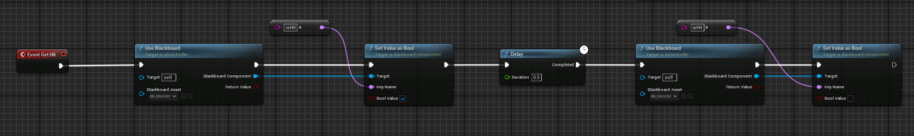

# 🧠 몬스터 AI 시스템 문서

**Monster AI 시스템**에 대한 설명으로, **Behavior Tree**와 **Blackboard**를 활용한 몬스터의 **상태 관리**와 **행동 처리**에 대해 다룹니다. 몬스터는 특정 **상태(상태 머신)**를 기반으로 **공격 패턴**, **행동 순서**, **플레이어와의 상호작용** 등을 처리합니다.

---

## 🛠 주요 함수

### 1. `Event Get Died`

- **역할**: 몬스터가 사망할 때 호출되는 함수입니다.
- **기능**:
  - `isDied` 값을 `true`로 설정하여 사망 상태로 전환합니다.
  - 아이템 드랍 → 5초 후 `DestroyActor`로 삭제됩니다.

---

### 2. `Run Behavior`

- **역할**: BeginPlay 시 호출되어 몬스터의 행동 트리(Behavior Tree)를 실행합니다.
- **기능**:
  - Cast To `Grux`, `Kraken`, `Dragon`을 통해 각 몬스터에 맞는 BT를 실행합니다.

---

### 3. `Event Get Hit`

- **역할**: 몬스터가 피격될 때 호출되는 함수입니다.
- **기능**:
  - isHit 값을 true로 설정하고, Blackboard에 데미지 수치를 반영합니다.
  - 이후 Tick 혹은 AI Logic에서 피해 처리를 진행합니다.

--- 

## ✅ 요약
| 항목 | 설명 |
|--------|------|
|`Behavior Tree`|몬스터의 전체 AI 흐름 담당|
|`Blackboard`|상태 변수 저장 (isHit, isDied, NDamage)|
|`Get Died`|아이템 드랍, 5초 후 제거|
|`Run Behavior`|몬스터별 BT 분기 처리|

### 🧾 참고
- BB_Monster: 몬스터 전용 Blackboard
- BT_Grux, BT_Kraken, BT_Dragon: 각각의 몬스터 전용 Behavior Tree

